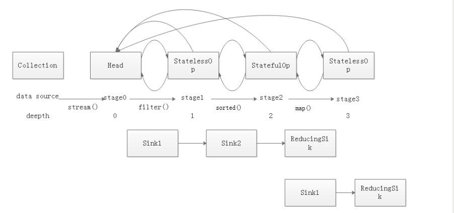
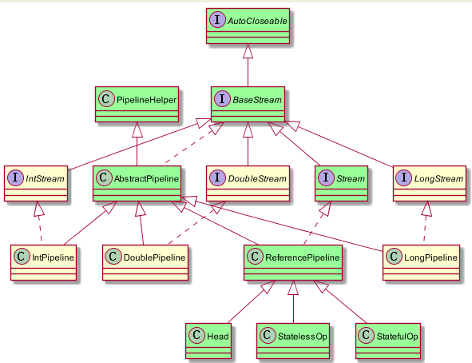
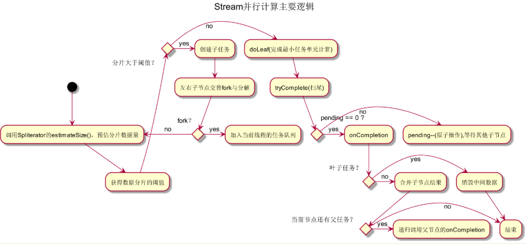

## Java8 Stream 设计思路编程

### Stream代码

Stream API中大量使用Lambda表达式作为回调方法，使用Stream代码形式入如下：

```java
int longestStringLengthStartingWithA
        = strings.stream()
              .filter(s -> s.startsWith("A"))
              .mapToInt(String::length)
              .max();
```

### 伪实现方式

仍然考虑上述求最长字符串的程序，一种直白的流水线实现方式是为每一次函数调用都执一次迭代，并将处理中间结果放到某种数据结构中（比如数组，容器等）。具体说来，就是调用`filter()`方法后立即执行，选出所有以*A*开头的字符串并放到一个列表list1中，之后让list1传递给`mapToInt()`方法并立即执行，生成的结果放到list2中，最后遍历list2找出最大的数字作为最终结果。程序的执行流程如如所示：


这样做实现起来非常简单直观，但有两个明显的弊端：

1. 迭代次数多。迭代次数跟函数调用的次数相等。
2. 频繁产生中间结果。每次函数调用都产生一次中间结果，存储开销无法接受。

这些弊端使得效率底下，根本无法接受。如果不使用Stream API我们都知道上述代码该如何在一次迭代中完成，大致是如下形式

```java
int longest = 0; 
for(String str : strings)
{ 
    if(str.startsWith("A")){// 1. filter(), 保留以A开头的字符串 
        int len = str.length();// 2. mapToInt(), 转换成长度 
        longest = Math.max(len, longest);// 3. max(), 保留最长的长度 }
    }
}
```


### Stream流水线设计思路

采用某种方式记录用户每一步的操作，当用户调用结束操作时将之前记录的操作叠加到一起在一次迭代中全部执行掉。


沿着这个思路，有几个问题需要解决：

1. 用户的操作如何记录？
2. 操作如何叠加？
3. 叠加之后的操作如何执行？
4. 执行后的结果（如果有）在哪里？


**将流操作分为中间结果(Intermediate Op)和(terminal Op), 分为多个阶段(stage)描述中间状态，且中间状态使用双向链表连接，采用惰性求值的方式，当执行terminal  OP结果的时候，链式查找到最开始的stage，按顺序对各个元素依次执行Sink的accept操作,最终得到结果集**

* 操作记录示意图


并行操作流水线

并行操作通过Fork-Join框架拆分数据源,到遇到stage链中一个状态是StatefulOp时，需要等到该操作处理完毕之后，才能接着处理接下来的操作




常情况下Stream的操作又需要一个回调函数，所以一个完整的操作是由数据来源、操作、回调函数组成的三元组来表示。而在具体实现中，使用实例化的ReferencePipeline来表示，即图1-2中的Head、StatelessOp、StatefulOp的实例 


Fork-Join


* Sink继承Consumer接口


* 执行的结果

  

| 返回类型 | 对应操作                          |
| -------- | --------------------------------- |
| boolean  | anyMatch() allMatch() noneMatch() |
| Optional | findFirst() findAny()             |
| 归约结果 | reduce() collect()                |
| 数组     | toArray()                         |


1. 对于表中返回boolean或者Optional的操作（Optional是存放 一个 值的容器）的操作，由于值返回一个值，只需要在对应的Sink中记录这个值，等到执行结束时返回就可以了。
2. 对于归约操作，最终结果放在用户调用时指定的容器中（容器类型通过[收集器](http://www.cnblogs.com/CarpenterLee/p/5-Streams%20API(II).md#%E6%94%B6%E9%9B%86%E5%99%A8)指定）。collect(), reduce(), max(), min()都是归约操作，虽然max()和min()也是返回一个Optional，但事实上底层是通过调用[reduce()](http://www.cnblogs.com/CarpenterLee/p/5-Streams%20API(II).md#%E5%A4%9A%E9%9D%A2%E6%89%8Breduce)方法实现的。
3. 对于返回是数组的情况，毫无疑问的结果会放在数组当中。这么说当然是对的，但在最终返回数组之前，结果其实是存储在一种叫做*Node*的数据结构中的。Node是一种多叉树结构，元素存储在树的叶子当中，并且一个叶子节点可以存放多个元素。这样做是为了并行执行方便。
4. 对于Stateful的Sink，Sink closed阶段会push 暂存的状态到下一个downstream,并且重置Skin的状态。

### 操作集分类

| 操作类型                | 描述                 | 举例                                                         |
| ----------------------- | -------------------- | ------------------------------------------------------------ |
| Intermediate Operations | Stateless            | unordered() filer() map() mapToInt() mapToLong mapToDouble() flatMap() flatMapToInt() flatMapToLong() flatMapToDouble() peek() |
| Intermediate Operations | Stateful             | distinct()  sorted() limit() skip()                          |
| Terminal Options        | None shot-circuiting | forEach() forEachOrdered() toArray() reduce() collect() max() min() count() |
| Terminal Options        | short-circuiting     | anyMatch() allMatch() noneMatch() findFirst() findAny()      |


#### Stream 类继承体系




### 影响因素(limit)

数据大小；源数据结构（分割越容易越好），arraylist、数组比较好，hashSet、treeSet次之，linked最差；装箱；核的数量（可使用）；单元处理开销（越大越好） 


### 意见及建议

1. Terminal Operation以外的操作，尽量避免副作用，避免突变基于堆栈的引用，或者在执行过程中进行任何I/O

2. 传递给流操作的数据源应该是互不干扰（避免修改数据源）。 


### 问题
1.stream().map().sorted()的流程是什么样的,数据是怎样feed到sorted的sink中的?

2.IntStream.of(asList(4,2,3,5)).stream().sorted()有没有对数据进行分割, 有没有创建新的数组?


## 附录


### Stream并行逻辑流程图




